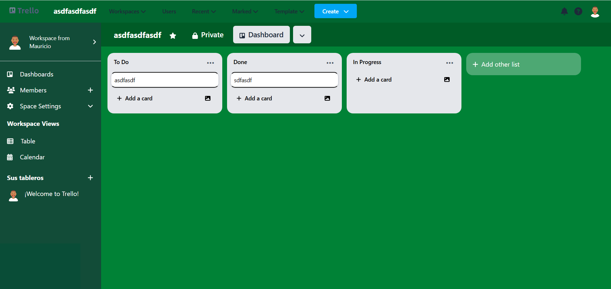

# Trello Clone

A full-stack application that replicates Trello's functionality using Angular for the frontend and Go for the backend.



## Features

- User authentication and authorization
- Board creation and management
- Lists and cards with drag-and-drop functionality
- Real-time updates
- User search and collaboration
- Email notifications

## Tech Stack

- **Frontend**: Angular with TailwindCSS
- **Backend**: Go with Gin framework
- **Database**: PostgreSQL
- **Containerization**: Docker

## Getting Started

### Local Development

#### Backend Setup

1. Navigate to the backend folder:
   ```bash
   cd backend
   ```

2. Install Go dependencies:
   ```bash
   go mod download
   ```

3. Create a `.env` file in the backend directory with the following content:
   ```
   DB_HOST=localhost
   DB_PORT=5432
   DB_USER=user
   DB_PASSWORD=password
   DB_NAME=trello_clone
   JWT_SECRET=YourSuperSecretJWT_Key_2024!x9P3qR7sT1vW5zX8aB4cD6eF2gH
   EMAIL_FROM=your-email@gmail.com
   EMAIL_PASSWORD=your-app-password
   SMTP_HOST=smtp.gmail.com
   SMTP_PORT=587
   ```

4. Run the PostgreSQL database (you can use Docker):
   ```bash
   docker run --name postgres -e POSTGRES_USER=user -e POSTGRES_PASSWORD=password -e POSTGRES_DB=trello_clone -p 5432:5432 -d postgres
   ```

5. Run the Go application:
   ```bash
   go run main.go
   ```

#### Frontend Setup

1. Navigate to the frontend folder:
   ```bash
   cd frontend
   ```

2. Install npm dependencies:
   ```bash
   npm install
   ```

3. Run the Angular application:
   ```bash
   ng serve
   ```

4. Access the application at [http://localhost:4200](http://localhost:4200)

### Docker Deployment

1. Make sure Docker and Docker Compose are installed on your system.

2. Clone the repository:
   ```bash
   git clone https://github.com/yourusername/trello-clone.git
   cd trello-clone
   ```

3. Start all services using Docker Compose:
   ```bash
   docker-compose up -d
   ```

4. Access the application at [http://localhost](http://localhost)

## Generating Gmail App Password for Email Notifications

To set up email notifications, you'll need to create an app password for your Gmail account:

1. Go to your Google Account settings at [https://myaccount.google.com/](https://myaccount.google.com/)
2. Select "Security" from the left sidebar
3. Under "Signing in to Google," select "2-Step Verification" (enable if not already enabled)
4. At the bottom of the page, select "App passwords"
5. Select "Mail" as the app and "Other" as the device
6. Enter a name (e.g., "Trello Clone")
7. Click "Generate"
8. Google will provide a 16-character app password
9. Copy this password and use it as the `EMAIL_PASSWORD` value in your `.env` file

## Using PGAdmin with Docker

PGAdmin is included in the Docker Compose setup for easy database management:

1. Start the application using Docker Compose as described above
2. Access PGAdmin at [http://localhost:8081](http://localhost:8081)
3. Login using:
   - Email: `admin@admin.com`
   - Password: `admin`
4. Add a new server with the following details:
   - Name: `Trello Clone DB`
   - Connection tab:
     - Host name/address: `db` (this is the service name in docker-compose)
     - Port: `5432`
     - Maintenance database: `trello_clone`
     - Username: `user`
     - Password: `password`
5. Click "Save" to connect to the database

## Project Structure

```
trello-clone/
├── backend/                # Go backend application
│   ├── controllers/        # HTTP request handlers
│   ├── middlewares/        # Authentication and other middleware
│   ├── models/             # Database models
│   └── routes/             # API route definitions
├── frontend/               # Angular frontend application
│   ├── src/
│   │   ├── app/
│   │   │   ├── auth/       # Authentication components
│   │   │   ├── boards/     # Board management
│   │   │   └── shared/     # Shared components and services
│   │   ├── assets/         # Static assets
│   │   └── environments/   # Environment configurations
│   └── Dockerfile          # Frontend Docker configuration
├── docker-compose.yml      # Docker Compose configuration
└── README.md               # Project documentation
```

## License

This project is licensed under the MIT License - see the [LICENSE](LICENSE) file for details.

The MIT License is a permissive license that allows for reuse with few restrictions. You are free to use, copy, modify, merge, publish, distribute, sublicense, and/or sell copies of this software, subject to the following conditions:

- The above copyright notice and this permission notice shall be included in all copies or substantial portions of the software.
- The software is provided "as is", without warranty of any kind.

## Contributing

Contributions are welcome! Please feel free to submit a Pull Request.

1. Fork the repository
2. Create your feature branch (`git checkout -b feature/amazing-feature`)
3. Commit your changes (`git commit -m 'Add some amazing feature'`)
4. Push to the branch (`git push origin feature/amazing-feature`)
5. Open a Pull Request

## Acknowledgments

- Inspired by [Trello](https://trello.com)
- Built with [Angular](https://angular.io) and [Go](https://golang.org)